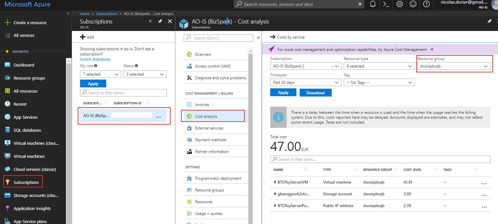
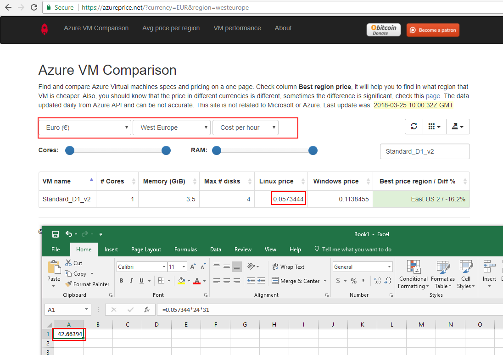
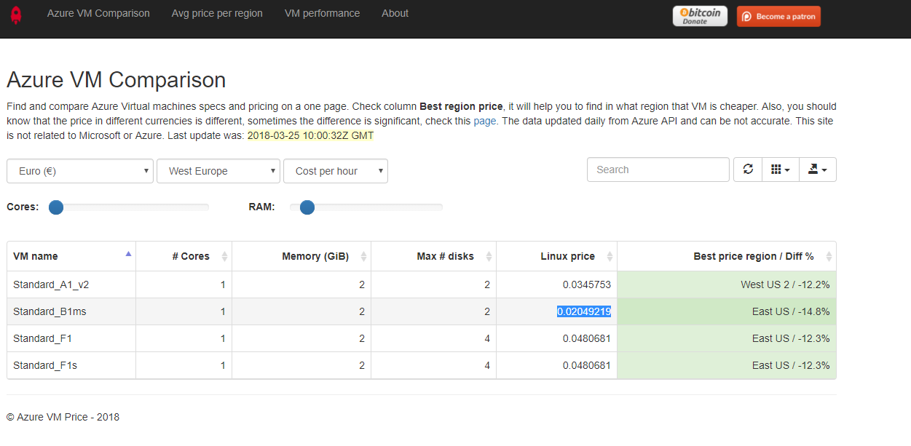
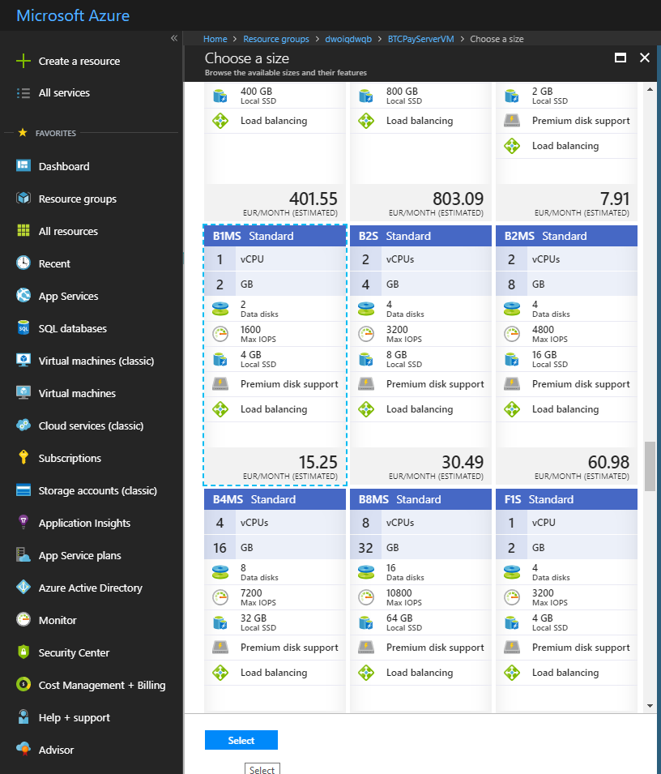
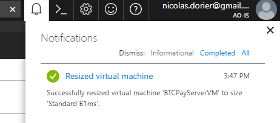

# The guide for penny pinching your Azure install

This guide is for [Azure install](https://github.com/btcpayserver/btcpayserver-azure) users who wishes to do some saving on their install.

Please do this **Only after your nodes are fully synched**. During synchronization you need a more powerful setup.

Penny pinching is an opportunity for you to better understand the resources you are consuming and tailor your configuration to your workload.

Downside:
* Running `btcpay-update.sh` or rebooting will take longer
* You might see `502 Bad Gateway` and your node taking lot's of time to start
* Your server might becomes very slower

Upside:
* 50% savings

If you find that your server is too slow: 
* Drop support of one coin by editing the setting `BTCPAY_DOCKER_COMPOSE` in `/etc/profile.d/btcpay-env.sh`, or
* Resize up your Virtual Machine

***************
*** WARNING ***

After some testing, it seems that following this guide for a setup on mainnet involving `BTC+LTC+CLightning` is a bit too much and make the server very laggy.

Note that the server becomes less laggy as time pass after restart, so it might still be ok for your case.

If it is not acceptable you should switch from `B1MS` (20 USD/Month) type to a `B2S` (40 USD/Month) type.

****************

## How much am I spending now?

You can find out how much cost your install by:

* Go on the Azure portal
* Go to Subscription (If you don't find the `Subscription` menu search `Subscription` in the search bar next to the notification's bell.)
* Go to Cost Analysis
* Select your Resource group (my one is called dwoiqdwqb)
* Timespan 30 days
* Click on apply



As you can see, my install cost `47.00 EUR/Month`, most of the cost spent on the virtual machine.

## What is my current configuration

First let's see what Virtual machine we currently have:

* Go on the Azure portal
* Go to Resource Groups
* Select your resource group
* Select BTCPayServerVM


As you can see the CPU is mainly unused, disk as well. We can probably cut the fat here.
Also my VM type is `Standard_D1_v2`. As you can see on [Azure Price Website](https://azureprice.net/).



This cost me `0.0573444 EUR/H` or `42.66 EUR/Month`.

Ok so now we know that downgrading this VM will bring us the largest cost benefit, let's see how far we can go.

Connect by SSH to your VM, then:

```
sudo su -
docker stats
```


As you can see, I have 3.352 GB of RAM, and around 55%.

The free command also seems to tell me I have approximately 1GB of RAM in fat:
```
root@BTCPayServerVM:~# free --human
             total       used       free     shared    buffers     cached
Mem:          3.4G       3.2G       138M        30M       8.8M       991M
-/+ buffers/cache:       2.2G       1.1G
Swap:           0B         0B         0B
```

## Selecting a new Virtual Machine

Now we know that 2 GB of RAM, and a less powerfull CPU will probably do the trick.

But first, you don't want your machine to crash if it runs out of RAM, so you need to add some swap:
Note that `/mnt` is used in Azure for temporary data, and is optimized for low latency, this is why we set the swapfile here.

```
sudo su -
fallocate -l 2G /mnt/swapfile
chmod 600 /mnt/swapfile
mkswap /mnt/swapfile
swapon /mnt/swapfile
echo "/mnt/swapfile   none    swap    sw    0   0" >> /etc/fstab
```

As you can see, the swap got added:
```
root@BTCPayServerVM:~# free -h
             total       used       free     shared    buffers     cached
Mem:          3.4G       3.2G       141M        30M       9.8M       983M
-/+ buffers/cache:       2.2G       1.1G
Swap:         **2.0G**         0B       2.0G
```

Now, go back to https://azureprice.net/, let's find something cheaper than `0.0573444 EUR/H`.



Wow! `Standard_B1ms` cost only `0.02049219 EUR/H`! Let's switch to it!

A quick look at [this article](https://www.singhkays.com/blog/understanding-azure-b-series/) shows us that this type of virtual machine is adapted for low CPU consumption with occasional burst. This is what BTCPay Server is about after the nodes are synched.

* Go on the Azure portal
* Go to Resource Groups
* Select your resource group
* Select BTCPayServerVM
* Select `Size`
* Select `B1MS` (if you don't see, take a look at the [FAQ](#b1ms))
* Click `Select`



Wait between 5 and 15 minutes.

When Azure is happy:



Congratulation, you just cut down the cost by 50% per month! :)


### FAQ: B1MS does not appear in the list <a name="b1ms"></a>

In some situation, you might not see the Virtual Machine B1MS in the list. It means your Azure hardware cluster does not support this type. 

** Warning: Stopping your Virtual Machine will change the public IP Address of your server. If you configured a A (as opposed to CNAME) record in your domain registar, you'll need to update it. **

You need to go in:

* Your Virtual Machine resource
* `Overview` menu
* Click on `Stop`


Wait the Virtual Machine get stopped, then change the size.

Once the size is changed, go back in `Overview` and click on `Start`.
