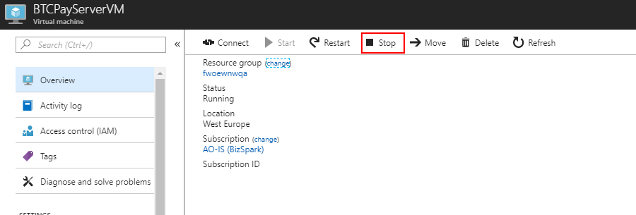

# The guide for penny pinching your Azure install

This guide is for Azure install users who wishes to do some saving on their install. (This guide cut the cost by 50%)
Please do this **Only after your nodes are fully synched**. During synchronization you need a powerful setup.

The reason this guide is necessary is that depending on what you are running, you might need more or less powerful machine.
Penny pinching is an opportunity for you to better understand the resources you are using and tailor your configuration.

## How much am I spending now?

You can find out how much cost your install by:

* Go on the Azure portal
* Go to Subscription 
* Go to Cost Analysis
* Select your Resource group (my one is called dwoiqdwqb)
* Timespan 30 days
* Click on apply


As you can see, my install cost `47.00 EUR` per month, most of the cost spent on the VM I am using.

## What is my current configuration

First let's see what Virtual machine we currently have:

* Go on the Azure portal
* Go to Resource Groups
* Select your resource group
* Select BTCPayServerVM


As you can see the CPU is mainly unused, disk as well. We can probably cut the fat here.
Also my VM type is `Standard_D1_v2`. As you can see on [Azure Price Website](https://azureprice.net/).


This cost me `0.0573444 EUR/H` per hour or `42.66 EUR/Month`.

Ok so now we know that downgrading this VM will bring us the largest cost benefit, let's see how far we can go.

Connect by SSH to your VM, then:

```
sudo su -
docker stats
```


As you can see, I have 3.352 GB of RAM, and around 55%.

The free command also seems to tell me I have approximately 1GB of RAM in fat:
```
root@BTCPayServerVM:~# free --human
             total       used       free     shared    buffers     cached
Mem:          3.4G       3.2G       138M        30M       8.8M       991M
-/+ buffers/cache:       2.2G       1.1G
Swap:           0B         0B         0B
```

## Selecting a new Virtual Machine

Now we know that 2 GB of RAM, and a less powerfull CPU will probably do the trick.

But first, you don't want your machine to crash if it runs out of RAM, so add some Swap:

```
sudo su -
fallocate -l 2G /swapfile
chmod 600 /swapfile
mkswap /swapfile
swapon /swapfile
echo "/swapfile   none    swap    sw    0   0" >> /etc/fstab
```

As you can see, the swap got added:
```
root@BTCPayServerVM:~# free -h
             total       used       free     shared    buffers     cached
Mem:          3.4G       3.2G       141M        30M       9.8M       983M
-/+ buffers/cache:       2.2G       1.1G
Swap:         **2.0G**         0B       2.0G
```

Now, go back to https://azureprice.net/, let's find something cheaper than `0.0573444 EUR/H`.


Wow! `Standard_B1ms` cost only `0.02049219 EUR/H`! Let's switch to it!

* Go on the Azure portal
* Go to Resource Groups
* Select your resource group
* Select BTCPayServerVM
* Select `Size`
* Select `B1MS` (if you don't see, the [FAQ](#b1ms))
* Click `Select`


Wait between 5 and 15 minutes.

When Azure is happy:


Congratulation, you just cut down the cost by 50% per month! :)


### FAQ: B1MS does not appear in the list <a name="b1ms"></a>

In some situation, you might not see the Virtual Machine B1MS in the list. It means your Azure hardware cluster does not support this type. 

** Warning: Stopping your Virtual Machine will change the public IP Address of your server. If you configured a A (as opposed to CNAME) record in your domain registar, you'll need to update it. **

You need to go in:

* Your Virtual Machine resource
* `Overview` menu
* Click on `Stop`



Wait the Virtual Machine get stopped, then change the size.

Once the size is changed, go back in `Overview` and click on `Start`.