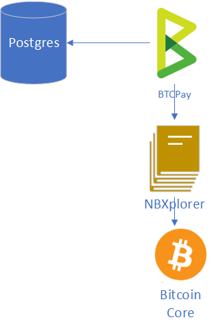

# BTCPay Server Documentation

## Introduction

BTCPay Server is an open source server compatible with the Bitpay API, written in .NET Core 2.0.  
BTCPay is not maintained by Bitpay. 

If you have any issues with BTCPay, please fill a [github issue](https://github.com/btcpayserver/btcpayserver-doc/issues).  
If you have more general questions, please come on [Slack](http://13.79.159.103:3000/).

Use BTCPay Server in the following case:

* You currently depend on Bitpay and want to keep using Bitcoin after november
* You do not want to give custody of your funds to a third party
* You have been rejected by Bitpay for KYC/AML reasons
* You are a service provider who wants to offer Bitcoin payments to your customer with a different pricing model than Bitpay
* You want to propose services similar to Bitpay for an alt currency.
* You want features Bitpay are not proposing (Multi-sig +Segwit support soon)

## Architecture

BTCPay is using a minimalist block explorer called [NBXplorer](https://github.com/dgarage/NBXplorer) which track HD derived addresses.
The Explorer depends on a trusted full node.

BTCPay server saves its data into either a SQLite or a PostgreSQL database.

## Where to go next?

If you are just curious to test it, go to [Getting Started](Getting-Started.md).

If you want to help development, go to [Local Development](Local-Development.md)

If you want to easily host your own server on testnet, go to [our docker's repository](https://github.com/btcpayserver/btcpayserver-docker) or see [our video](https://www.youtube.com/watch?v=a5ehSfzYkJo).

## Integrations

### Wordpress/Woocommerce

You can integrate to woocommerce by using [our plugin](https://github.com/btcpayserver/woocommerce-plugin/), as documented on [this video](https://www.youtube.com/watch?v=6rd8ZpLrz-4/)
