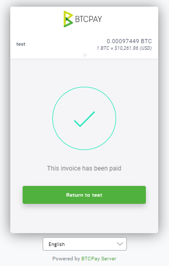

# Testing BTCPay Server

Testing the software is a great way to contribute to the project. There are many different ways that someone can _test_ the software. Users who manually test (QA) the software and features to provide user experience, feedback or bugs to the project developers and designers is always appreciated. 

Since the software is open source, anyone can test and audit the code. Some merchants or other technical users may want verify new or existing features by testing the software themselves. Developers working on the code can also benefit from understanding how to manually test certain actions in BTCPay.

This guide will show you how to manually test some common BTCPay features and assumes you already have your [Local Development Environment](ContributeDevCode.md) set up. Once you understand the basic testing actions, most other features can be manually tested in a similar way. 

## Setup Regtest Network & Local BTCPay

First, be sure you have completed the following:

- Option 1: Test the latest code - [Pull master](ContributeDevCode.md#sync-forked-btcpayserver-repository)
- Option 2: Test a new feature - [Pull request](ContributeDevCode.md#create-a-branch-of-a-pull-request)
- Created a local [Regtest Network](ContributeDevCode.md#bitcoin-regtest-network-setup)
- Built your solution and started [Debug mode](ContributeDevCode.md#build-local-btcpayserver) 

## Create Invoice

Creating an invoice and sending payment is an important feature in BTCPay and in order to manually test this, you must first:

- Create a Store 
- Modify your store Derivation Scheme 

:::tip
Use the hot wallet for fastest wallet setup during testing. Import from ... > a new/existing seed > check Is hot wallet > Generate
:::

- Create an invoice for your store

 ## Pay Invoice

Open a new Powershell terminal and navigate to your `BTCPayServer.Tests` directory where our Docker-Compose commands are run for the project. Copy the amount and address for payment from your invoice. Add them into the following command:

`.\docker-bitcoin-cli.ps1 sendtoaddress "bcrt1qym96l8gztggldraywdumgmfw27u8p8h5w7h9kc" 0.00097449` then press `Enter`.

Notice that your invoice has now been paid in your local BTCPay Server

## Testers FAQ

### Start Debugging gives Error: No connection could be made because the target machine actively refused it. 127.0.0.1:39372

If you see this error, it means you did not set up your Regtest Network using the `Docker-Compose up dev` command in the `BTCPayServer.Tests` directory. This command will set up all the dependencies you need for services used by BTCPay in the local development environment. You must run it before you try to start debugging. 
