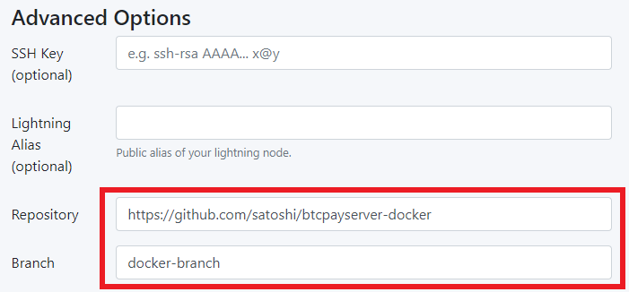

# Testing BTCPay Server

Table of contents:

- [Testing BTCPay Server](#testing-btcpay-server)
  - [Setup Regtest Network and Local BTCPay Server](#setup-regtest-network-and-local-btcpay-server)
  - [Using Docker Images for Mainnet Testing](#using-docker-images-for-mainnet-testing)
  - [Create Invoice](#create-invoice)
  - [Pay Invoice](#pay-invoice)
  - [Testers FAQ](#testers-faq)
    - [Start Debugging gives Error: No connection could be made because the target machine actively refused it. 127.0.0.1:39372](#start-debugging-gives-error-no-connection-could-be-made-because-the-target-machine-actively-refused-it-12700139372)

Testing the software is a great way to contribute to the project. There are many different ways that someone can _test_ the software. Users who manually test (QA) the software and features to provide user experience, feedback or bugs to the project developers and designers is always appreciated. 

Since the software is open source, anyone can test and audit the code. Some merchants or other technical users may want verify new or existing features by testing the software themselves. Developers working on the code can also benefit from understanding how to manually test certain actions in BTCPay.

This guide will show you how to manually test some common BTCPay features and assumes you already have your [Local Development Environment](ContributeDevCode.md) set up. Once you understand the basic testing actions, most other features can be manually tested in a similar way. 

## Setup Regtest Network and Local BTCPay Server

First, be sure you have completed the following:

- Option 1: Test the latest code - [Pull master](ContributeDevCode.md#sync-forked-btcpayserver-repository)
- Option 2: Test a new feature - [Pull request](ContributeDevCode.md#create-a-branch-of-a-pull-request)
- Created a local [Regtest Network](ContributeDevCode.md#bitcoin-regtest-network-setup)
- Built your solution and started [Debug mode](ContributeDevCode.md#build-local-btcpayserver)

## Using Docker Images for Mainnet Testing

Some features are not suitable for testing using a localhost development environment. Integration type features often require mainnet or testnet payments in order to be sufficiently tested. This will show you how to deploy a custom docker image containing an unreleased feature for testing on a live server.

Step 1: 

[Fork, clone and create a branch](./ContributeDevCode#git-setup) of the [BTCPay Server repository](https://github.com/btcpayserver/btcpayserver) and name your branch: `btcpay-branch`. 

For simplicity, let's say the feature you want to test has already been merged into master, which is not yet released. This way our branch can be based off master. To test a specific unreleased feature, merge it into your branch instead.

Step 2: 

[Fork, clone and create a branch](./ContributeDevCode#git-setup) of the [BTCPay Server Docker repository](https://github.com/btcpayserver/btcpayserver-docker) and name your branch: `docker-branch`. 

Step 3: 

Create a Docker Hub account, Docker repository, download Docker Desktop and Login to your account by following [these steps](https://docs.docker.com/docker-hub/).

Step 4: 

Since BTCPay Server requires a blockchain sync, it's easiest to use an already deployed & synced server. This server should be deployed referencing your own `docker-branch` created in step 2. See this example using the [LunaNode launcher](https://launchbtcpay.lunanode.com/):



Note: If you are testing the altcoin build, deploy your server to use the altcoin `BTCPAY_BUILD_CONFIGURATION`.

Step 5:

Inside of your btcpayserver root directory there are Dockerfiles prefixed by the following amd64, arm32v7, arm64v8. We need to build and push the custom image using the Dockerfile for the OS being used. Replace yourRepo and tag in the following commands:

```
#build image
docker build -t <yourRepo>/btcpayserver --file ./amd64.Dockerfile .

#push image
docker push <yourRepo>/btcpayserver:1.0.0.1
```

Step 6: 

Check that your image appears in your Docker Hub repository and the version tag matches the one you have supplied in the push command above.

Step 7: 

Locate the [btcpayserver.yml docker-fragment](https://github.com/btcpayserver/btcpayserver-docker/tree/master/docker-compose-generator/docker-fragments) in your local `docker-branch`. Update the btcpayserver image's referenced repository (example: satoshi) and tag version (example: 1.0.0.1) with the one you have supplied in your push command above.

```yaml
image: ${BTCPAY_IMAGE:satoshi/btcpayserver:1.0.0.1$<BTCPAY_BUILD_CONFIGURATION>?}
```

Step 8: 

Push your local `docker-branch` changes to your BTCPayServer Docker repository.

Step 9: 

SSH into your vps and update your server.

Now you can test your feature as if it was already released!

## Create Invoice

Creating an invoice and sending payment is an important feature in BTCPay and in order to manually test this, you must first:

- Create a Store 
- Modify your store Derivation Scheme 

:::tip
Use the hot wallet for fastest wallet setup during testing. Import from ... > a new/existing seed > check Is hot wallet > Generate
:::

- Create an invoice for your store

 ## Pay Invoice

Open a new Powershell terminal and navigate to your `BTCPayServer.Tests` directory where our Docker-Compose commands are run for the project. Copy the amount and address for payment from your invoice. Add them into the following command:

`.\docker-bitcoin-cli.ps1 sendtoaddress "bcrt1qym96l8gztggldraywdumgmfw27u8p8h5w7h9kc" 0.00097449` then press `Enter`.

Notice that your invoice has now been paid in your local BTCPay Server.


## Testers FAQ

### Start Debugging gives Error: No connection could be made because the target machine actively refused it. 127.0.0.1:39372

If you see this error, it means you did not set up your Regtest Network using the `docker-compose up dev` command in the `BTCPayServer.Tests` directory. This command will set up all the dependencies you need for services used by BTCPay in the local development environment. You must run it before you try to start debugging. 
