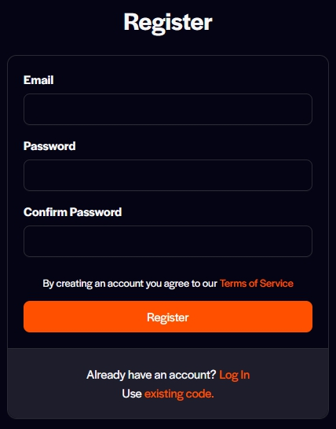
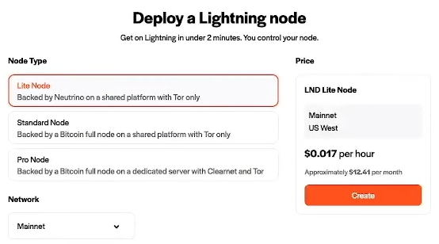

# Voltage Cloud BTCPay Server web deployment

We will explain how to deploy the BTCPay Server on `Voltage Cloud`. 
Voltage cloud is building Bitcoin and Lightning infrastructure. Its mission is to provide easy and scalable solutions to a Bitcoin standard. 
They've built an easy-to-use onboard flow to the BTCPay Server and provide an easy solution for Lightning Network usage. 
It's modular. Pick your Bitcoin node, decide if you want to use Lightning, and then put a BTCPay server on top. 
They also offer a solution for inbound liquidity once you have Lightning running. 

In the video below, [BTC Sessions](https://twitter.com/BTCsessions) goes through all the steps for setting up **BTCPay server on Voltage Cloud**.

## 1. Sign up and top up your account.

First off, sign up and add credit to your account. 
Go to the [Voltage cloud](https://account.voltage.cloud/register) website to create an account. 

Upon registering, to top up the account go to` Billing` and add `Node credit` to your account. 
Filling up your account can be done by paying in Bitcoin, Lightning, or by credit card. 
Return to the main dashboard of Voltage. 

## 2. What node suits you? 

The dashboard asks us what to do. 
In this section, we go into the `Nodes` tab and leave `Flow` for now. 
By clicking `Nodes`, we are now prompted to **Create Node**

For running the BTCPay server with Lightning-enabled, we will have to create two nodes. 
First, you have to create the Lightning Node, click on LND button. 
After that, it makes your choice between three options of nodes.

* Lite node 
* Standard Node
* Pro node 

Each comes with its own pro's and con's. The pro node requires you to contact Voltage's marketing team to customize your node plan. 
It will also show you the cost of the node per hour rate and an approximate for a full month. 

Now we get into naming your node and securing it with a strong password
There is also an option to restore a previous node from seed and a Static Channel backup. 

:::warning
This password is something to backup securely. As Voltage can **NOT** recover this for you
:::

## 3. Node dashboard

After completing the above steps, you are now in your Voltage node's dashboard. 
It shows you the node's status, the version LND it runs, the API endpoint, and some other tiles with information on your new node.
This is when we will start working towards our **BTCPay server node**. 

The top right corner of your dashboard will allow you to switch between `Nodes` and `Flow`.
Click on `Nodes` as we want a BTCPay server node and create a new node. 

## 4. BTCPay server node

Now we are looking at creating a BTCPay Server node. 
It tells us the approximate cost hourly and monthly again as it did with the LND node. 

Click on the `Create` button and lets set the store initials.
You now have to set a `Store name` for the main store of your BTCpay server. 
The choice to connect it to your Voltage node and pick the node you created earlier (the LND node)
And lock this in by typing the password set for the LND node. 

## 5. Finnish initial deployment. 

With all the steps taken above and following along with the video above, you are now at the point where Voltage shows you the BTCPay server information. 

* URL for BTCPay Server access
* Username for the BTCPay Server's store. 
* Default password
* Attached Node Name 
* Creation date of the node
* Expiration date
* Purchase status 

A button for easy access to your BTCPay Server dashboard and the button to delete the instance also became available to you. 
Now click the button to go to the BTCPay server dashboard, and you are ready to start operating as a merchant on Bitcoin! 

## 6. Welcome to your BTCPay server dashboard. 

You are now inside your new BTCPay server. 
It shows in the dashboard that you've created a store and that Lightning Network has been set up. 
The Bitcoin Wallet is still missing. You can follow along in [this wallet setup guide](../WalletSetup.md)

:::tip
If there are questions about your node, the deployment or updates, please reach out to the support of [Voltage Cloud](https://voltage.cloud)
:::