# Connecting Electrum Wallet to BTCPay Server

This documents explains **how to connect a desktop [Electrum Wallet](https://electrum.org/) to a BTCPay Server**.

**Word of caution** Electrum wallet relies on Electrum servers that are controlled by third-parties. Information, like public addresses, balances and the transacted amount can *potentially* be leaked.

To protect yourself against such leaks, set up [ElectrumX Server](./ElectrumX.md) or [Electrum Personal Server - EPS](https://github.com/chris-belcher/electrum-personal-server).

You can read about the differences between EPS and ElectrumX [here](https://www.reddit.com/r/Electrum/comments/7xb0lz/whats_the_difference_between_electrumx_server_and/).

1. Create a Store in BTCPay Server
2. [Download](https://electrum.org/#download) and install Electrum Wallet

## Electrum Wallet Setup

After the installation, open **Electrum Wallet** by clicking on the icon on your desktop.

### Quick Setup

The easiest way to setup your Electrum wallet with BTCPay is to import an a wallet file backup to your BTCPay Server.

1. Create a new Electrum Wallet
2. In Electrum, File > Save Backup > Save in folder
3. In BTCPay Server, Store > Settings > Setup > Import Wallet File > Choose File > Continue
4. Go to Receive tab in Electrum.
5. Compare the addresses in Electrum and BTCPay Server, they should match.
6. Confirm the address match in BTCPay.

## Step by Step

The following setup guides you through setting up an entirely new Bech32(SegWit) Wallet in Electrum. If you already have a wallet skip to the Extended Public Key copying.

Firstly, give your wallet a name, for example, `BTCPay Server Wallet` and click `Next`.

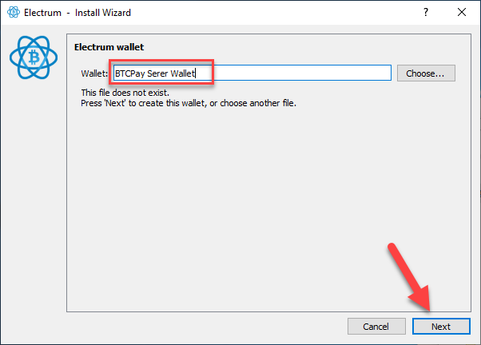

Choose `Standard wallet` and proceed by clicking the `Next`button.

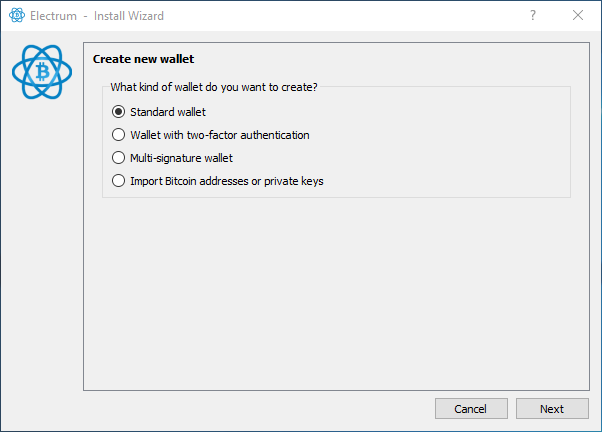

Since we're creating a brand-new wallet,choose  `Create a new seed` and `Next`

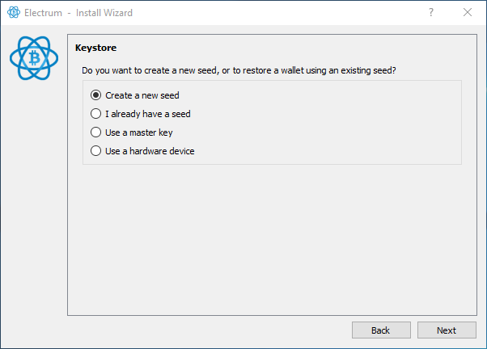

From the multiple choice menu, select `SegWit` and `Next`

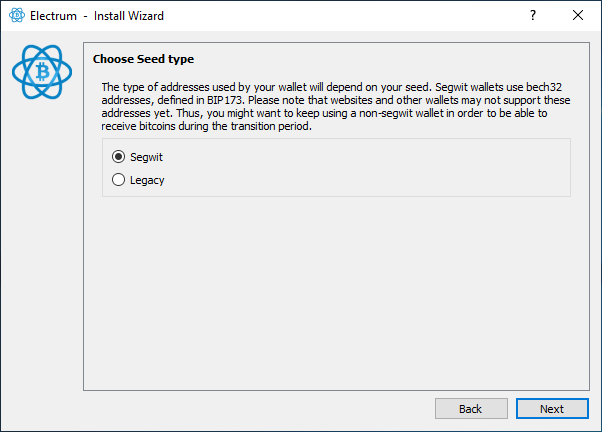

**IMPORTANT NOTE:** If you're a merchant, instead of SegWit (Bech32), it's recommended to use SegWit wrapped (P2SH) format. [This guide](https://www.youtube.com/watch?v=-1DBJWwA2Cw) explains how to create P2SH wallet in Electrum that's more suited for merchants, due to compatability with legacy wallets customers use.

**IMPORTANT NOTE 2:** Write down your recovery words in the order you see them on the screen. Write them down a piece of paper and store it somewhere secure. Take your time and triple check each word. Do not store your seed in a digital format (photograph, text document). Whoever has the access to your seed can access your funds. Confirm that the seed has been properly backed up by re-entering it in the same order. Once the seed is validated, proceed to the next step.

Copy and paste your seed words to complete your wallet creation in Electrum.

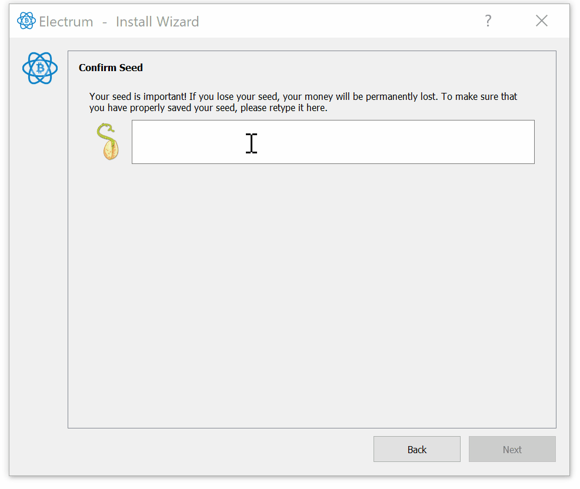

Export and save a backup copy of your wallet.

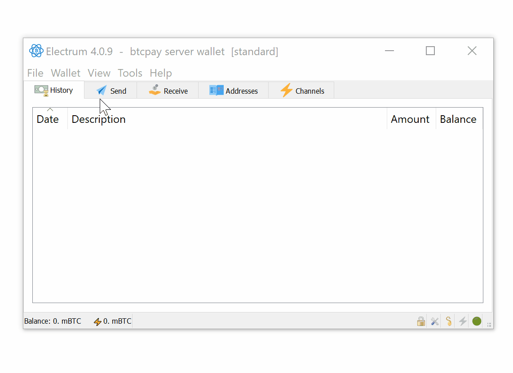

Import your wallet into your BTCPay store.

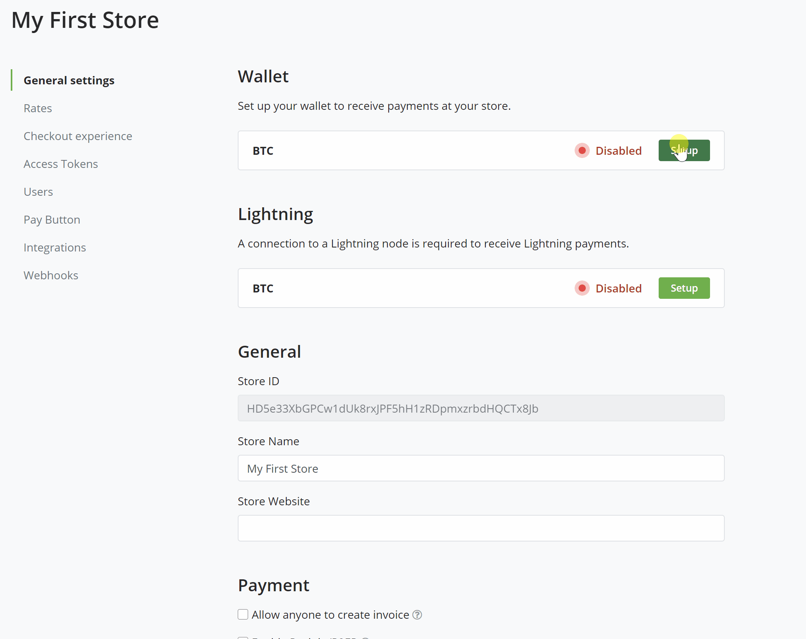

Compare your addresses in your BTCPay store.

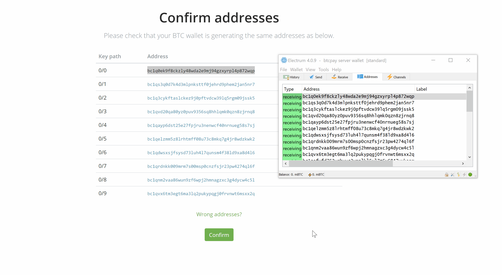

It's highly recommended that you encrypt your wallet. Select a password that you can easily remember and mark make sure `Encrypt Wallet File` is marked. Proceed by clicking `Next`.

When the wallet loads (it may take few moments), in the top menu, click on the `Wallet` and then`Information` .

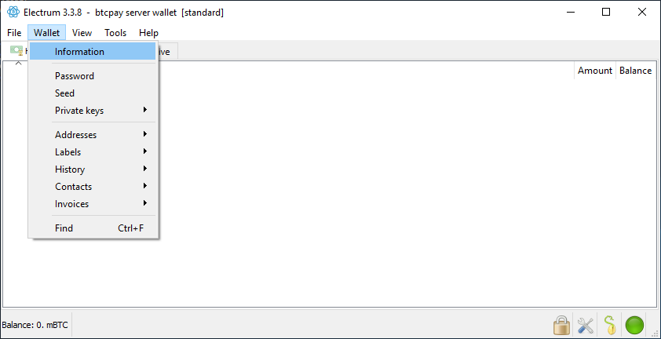

Select and **copy** the `Master Public Key`. This is the **public** key from which BTCPay will derive addresses.

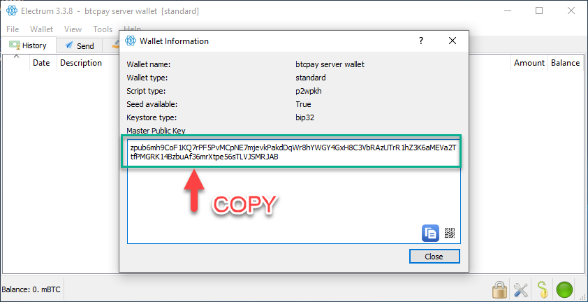

Return to your BTCPay Server. Click on the `Stores` in the header menu and select Settings. Find Wallet and click on the `Setup` button.

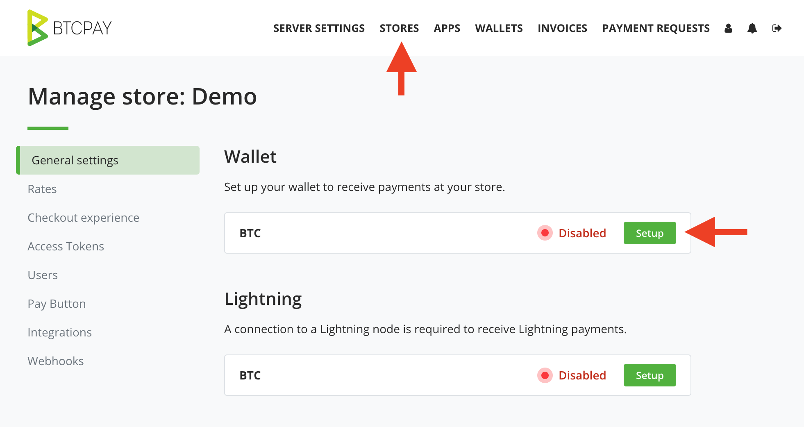

Paste the `Master Public Key` into derivation scheme field as it is, without adding anything else. Make sure that `Enabled` checkbox is ticked and click `Continue`.

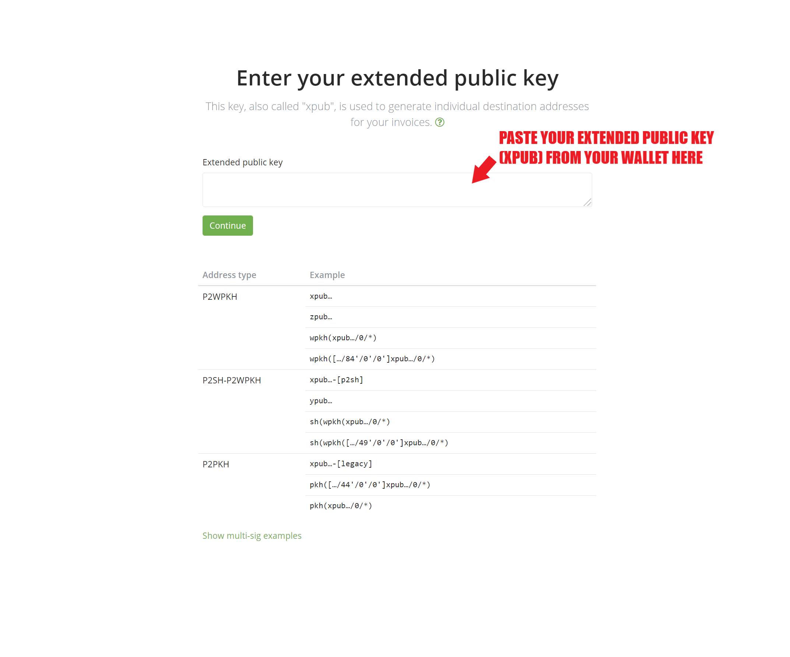

Return to the **Electrum Wallet**. Go to `Receive tab` which shows your wallet receiving address.

**Compare the address you see in Electrum Wallet to Addresses shown in BTCPay Server**. If there's a match, `continue`. If there is no match, copy the address from Electrum and paste it into `Hint Address Form`. If you still can't get the matching, double-check that you're actually pasting `Master Public Key`.

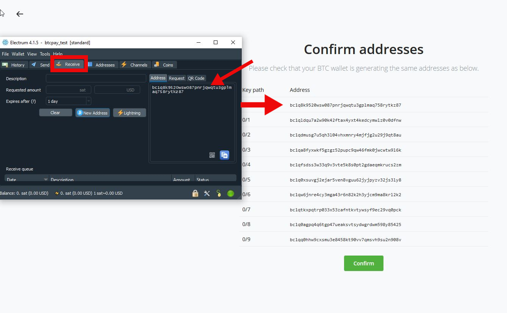

### Alternative Setup

Instead of importing a wallet file you can instead transfer the public key to your BTCPay Server. This can be useful if your wallet is encrypted and you do not want to unencrypt it.

1. Create a new Electrum Wallet
2. In Electrum, Wallet > Wallet Information - copy the **Master Public Key**.
3. In BTCPay Server, Store > Settings > Setup > Connect an existing wallet > Enter extended public key
4. Go to Receive tab in Electrum.
5. Compare the addresses in Electrum and BTCPay Server, they should match.
6. Confirm the address match in BTCPay.

### Configuring the Gap Limit in Electrum

 In the top menu, click on the `View` and then`Show Console` .

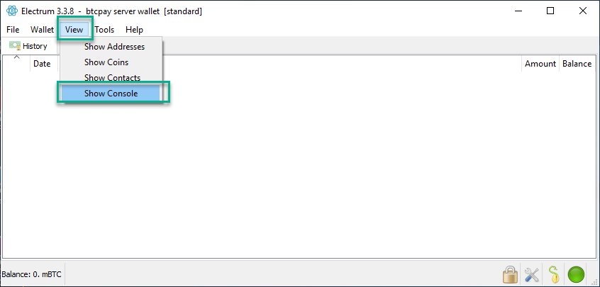

Enter following commands in Electrum console and press `enter`on your keyboard.

```
 wallet.change_gap_limit(100)
```
If you are running a version older than Electrum 4, also enter the following command and press 'enter'

```
wallet.storage.write()
```

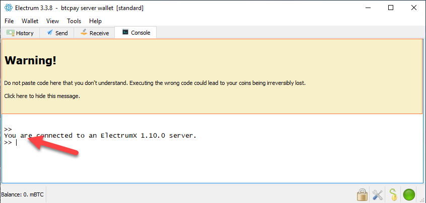

Restart your Electrum and verify that the newly set gap limit is correct by entering in the console:

```
wallet.gap_limit
```

There's no good answer to how much you should set the gap limit to. Most merchants set 100-200. If you're a big merchants with high transaction volume, you can try with even higher gap limit.

For more details about the [Gap Limit, check the FAQ](./FAQ/FAQ-Wallet.md#missing-payments-in-my-software-or-hardware-wallet).

**Electrum and BTCPay Server are now connected**. Any payments received to your BTCPay will be visible in Electrum, where you can further spend them.
