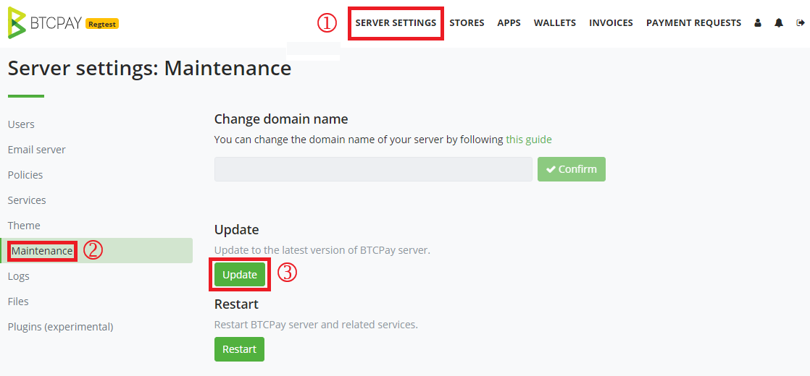
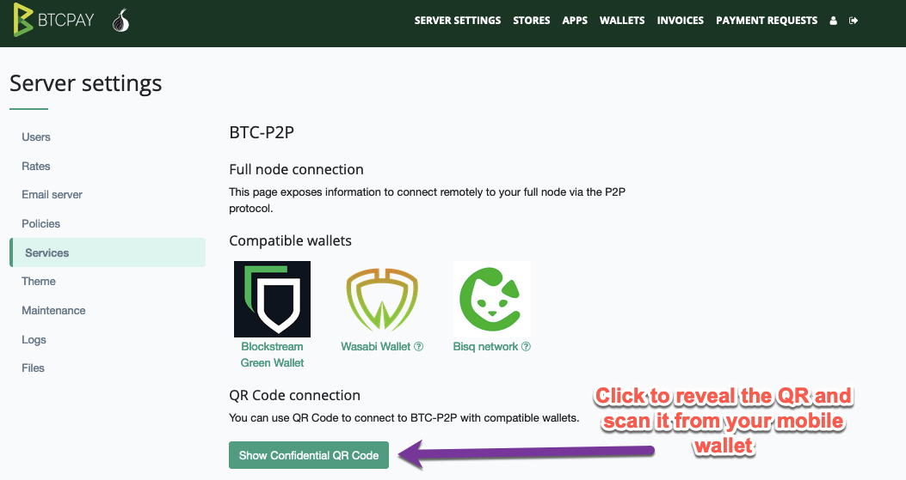

# Server Settings Frequently Asked Questions

This document covers all the questions and issues related to Server Settings. These settings are only available to the server admin. Take a look at the [walkthrough page](../Walkthrough.md) to learn more.

## Maintenance

* [How to update BTCPay Server?](./FAQ-ServerSettings.md#how-to-update-btcpay-server)
* [How can I check my BTCPay Server version?](./FAQ-ServerSettings.md#how-can-i-see-my-btcpay-version)
* [How can I check my BTCPay Server version via terminal?](./FAQ-ServerSettings.md#how-can-i-see-my-btcpay-version)
* [What is BTCPay SSH key file?](./FAQ-ServerSettings.md#what-is-btcpay-ssh-key-file)
* [Error the BTCPAY_SSHKEYFILE variable is not set/ Unable to update](./FAQ-ServerSettings.md#btcpay-sshkeyfile-is-not-set-when-running-the-docker-install-or-unable-to-update-through-server-settings-maintenance)
* [Forgot BTCPay Admin password](./FAQ-ServerSettings.md#forgot-btcpay-admin-password)
* [How to disable U2F and 2FA for a user?](./FAQ-ServerSettings.md#how-to-disable-u2f-and-2fa-for-a-user)
* [How to configure SMTP settings in BTCPay?](./FAQ-ServerSettings.md#how-to-configure-smtp-settings-in-btcpay)
* [How to SSH into my BTCPay running on VPS?](./FAQ-ServerSettings.md#how-to-ssh-into-my-btcpay-running-on-vps)
* [Error: Your local changes to the following files would be overwritten by merge](./FAQ-ServerSettings.md#error-your-local-changes-to-the-following-files-would-be-overwritten-by-merge)

## Theme / Customization

* [How to customize my BTCPay theme style?](./FAQ-ServerSettings.md#how-to-customize-my-btcpay-theme-style)
* [How to add Google Analytics code to BTCPay?](./FAQ-ServerSettings.md#how-to-add-google-analytics-code-to-btcpay)
* [How to modify the BTCPay checkout page?](./FAQ-ServerSettings.md#how-to-modify-the-checkout-page)

## Policies

* [How to allow registration on my BTCPay Server?](./FAQ-ServerSettings.md#how-to-allow-registration-on-my-btcpay-server)
* [How to hide my BTCPay Server from Search Engines?](./FAQ-ServerSettings.md#how-to-hide-my-btcpay-server-from-search-engines)

## Services

* [How to remotely connect to my BTCPay full node?](./FAQ-ServerSettings.md#how-to-remotely-connect-to-my-btcpay-full-node)

## Files

* [How to upload files to BTCPay?](./FAQ-ServerSettings.md#how-to-upload-files-to-btcpay)

## Maintenance

### How to update BTCPay Server

There are 2 ways to update your BTCPay Server :
1. Updating through the front end: Server Settings > Maintenance > Update.



2.Updating through SSH: Login into your virtual machine with ssh, then apply following commands:

```bash
sudo su -
btcpay-update.sh
```

### How can I see my BTCPay version?

You can see your BTCPay version in the bottom right of the page footer when you're logged in as a server admin.

### How can I check my BTCPay Server version via terminal?

In the btcpayserver-docker folder:`bitcoin-cli.sh getnetworkinfo`

### What is BTCPay SSH key file?

BTCPay SSH key, enables users to update their server or quickly change the domain name from btcpay website, the front-end.

### Forgot BTCPay Admin password?

First, register a new user on your BTCPay Server, by clicking "Register", for example: "newadmin@example.com".

If you can't create a new user because registrations are disabled in your Server Settings > Policies, you need to reset the policies settings. Please skip this step if you can create a new user on the front-end home page using the register button. Run the following command (It also deletes any other server settings currently being used):

```bash
# In root
sudo su -
cd $BTCPAY_BASE_DIRECTORY/btcpayserver-docker/
# Re-open registrations
./btcpay-admin.sh reset-server-policy
```

Head back to your BTCPay Server and click on the "Register" button which should now be enabled. In case you don't see the Register link in the menu, that's probably because of the caching. Restart your btcpay with `btcpay-restart.sh`.

Next, add the newly registered user `newadmin@example.com` as an admin:

```bash
# Set new user as admin
./btcpay-admin.sh set-user-admin newadmin@example.com
```
Now you can access with `newadmin@example.com` as admin.

When you apply the changes, you'll noticed that newly created user isn't the member of any stores. In that case, [follow this guide](https://gist.github.com/justinmoon/8128e66fc11d90ae5732f2491570bfc5) to add the new users to all or certain stores.

### How to disable U2F and 2FA for a user

Remove U2F and 2FA settings for a registered user, for example `user@example.com` with the following commands:

```bash
# In root
sudo su -
cd $BTCPAY_BASE_DIRECTORY/btcpayserver-docker/
# Disable U2F and 2FA
./btcpay-admin.sh disable-multifactor user@example.com
```

## BTCPAY_SSHKEYFILE is not set when running the docker install, or unable to update through Server Settings / Maintenance

You may see such the following message when you run your docker-compose (either via `btcpay-up.sh` or `btcpay-setup.sh`):

```bash
WARNING: The BTCPAY_SSHKEYFILE variable is not set. Defaulting to a blank string.
WARNING: The BTCPAY_SSHTRUSTEDFINGERPRINTS variable is not set. Defaulting to a blank string.
```

`BTCPay Server` requires SSH access, to allow you to perform the following tasks from the front-end:

* Updating the server
* Changing the domain name of the server

You can run the following command line to give access to BTCPay to your server via SSH.

```bash
sudo su -
cd $BTCPAY_BASE_DIRECTORY/btcpayserver-docker
git checkout master
# Setup SSH access via private key
ssh-keygen -t rsa -f /root/.ssh/id_rsa_btcpay -q -P "" -m PEM
echo "# Key used by BTCPay Server" >> /root/.ssh/authorized_keys
cat /root/.ssh/id_rsa_btcpay.pub >> /root/.ssh/authorized_keys
BTCPAY_HOST_SSHKEYFILE=/root/.ssh/id_rsa_btcpay
. ./btcpay-setup.sh -i
```
### How to configure SMTP settings in BTCPay?

SMTP can be configured in settings for each store. It can also be configured for the entire server if you have admin privileges.

Each e-mail provider has different configuration, so we can't provide you with exact setup, but here's the configuration for gmail which should work:
```
SMTP Host: smtp.gmail.com
SMTP Port: 587
SSL Protocol: ON
TLS Protocol: ON
SMTP Username: (your Gmail username)
SMTP Password: (your Gmail password)
```
For gmail it's important to allow access from less secure apps. To enable go to: Manage Your Google Account > Security > Allow Less Secure Apps (On). Also note Google may automatically turn off this setting if it’s not being used. If your smtp has stopped working, check this setting is not off.

If by any chance you have 2-step verification added to your gmail account, [visit this article](https://support.google.com/mail/answer/185833?hl=en).

Use the test email feature in BTCPay to verify your emails are being sent properly. If you are seeking a more reliable smtp service for your business needs, consider using a dedicated mail service like Mailgun.

### How to SSH into my BTCPay running on VPS?

Follow these instructions to SSH via domain or IP:

```
ssh domainuser@example.com (domain)
or
ssh domainuser@70.32.86.175 (IP)

domainuser@example.com's passowrd:
yourPassword
```
Press Enter

If this is your first time connecting to the server from this computer, you will see the following output.
```
The authenticity of host 'example.com (70.32.86.175)' can't be established.
RSA key fingerprint is 3c:6d:5c:99:5d:b5:c6:25:5a:d3:78:8e:d2:f5:7a:01.
Are you sure you want to continue connecting (yes/no)?

yes
```

Or see this [LunaNode example](https://github.com/JeffVandrewJr/patron/blob/master/SSH.md) with PuTTY.

### Error: Your local changes to the following files would be overwritten by merge

Sometimes, an accidentally edited file can break the update mechanism with the following error:

```bash
error: Your local changes to the following files would be overwritten by merge:
```

To fix the this, [ssh into your server](https://github.com/JeffVandrewJr/patron/blob/master/SSH.md)

```bash
sudo su -
cd btcpayserver-docker
git reset --hard origin/master
```

## Theme / Customization

### How to customize my BTCPay theme style

There are two ways to customize the theme of your BTCPay.
The easy way is to head over to the **Server Settings > Theme** and follow the instructions on how to [change your Bootstrap theme](../Theme.md#bootstrap-themes).

For advanced theme changes, you'll most likely need to fork  BTCPay repository and apply desired design changes. Build and publish the docker image to Docker Hub. Set the `BTCPAY_IMAGE` environment variable to your docker image tag(`export BTCPAY_IMAGE="your custom btcpay docker image"`) and run the setup (`. ./btcpay-setup.sh -i`) as usual from [BTCPay Docker](https://github.com/btcpayserver/btcpayserver-docker). Modify generated docker compose to use your custom docker image. **You will need to create a new image manually and follow these steps for EACH BTCPay update so it is advised to stick with the default setup.**

### How to add Google Analytics code to BTCPay

You should be able to do what you want by injecting your GA code to `~/wwwroot/checkout/js/core.js.` Might be the easiest way but you have to redo it every time you update BTCPay to the latest version. Then you won’t have the hassle of forking the code, deploying it manually. Every time there is an update. Just do the docker update and add the same lines to the js file.

### How to modify the checkout page?

You can easily change the appearance of your BTCPay's checkout page by following the [instructions here](../Theme.md#checkout-page-theme)

## Policies

### How to allow registration on my BTCPay Server

To allow other users to register and use your server, in Server Settings > Policies enable registration. If you [configured SMTP properly](FAQ-ServerSettings.md#how-to-configure-smtp-settings-in-btcpay), you can request users e-mail confirmation to prevent spam or bot registering on your instance.

### How to hide my BTCPay Server from Search Engines

Discouraging search engines from indexing your site in Server Settings > Policies, adds `<meta name="robots" content="noindex">` to your server header, which informs search engines not to index your pages.

It is up to search engines to honor this request, and may take time for your pages to disappear completely. Unfortunately, the exact time is beyond our control, it depends on crawl bots of particular search engine like Google.

## Services

### How to remotely connect to my BTCPay full node?

If you're using an external wallet which allows BTC-P2P connection, you can easily connect it to your BTCPay full node. By doing this, you avoid leaking information to third-party servers and are solely relying on your own full node.
To connect to a compatible BTC-P2P wallet, go to **Server Settings > Services > Full node P2P** Reveal the QR code and scan it with a BTC-P2P compatible wallet, or input it by copy-pasting it.



If you do not see Full node P2P in your Services, you probably have to [activate Tor on your server](FAQ-Deployment.md#how-do-i-activate-tor-on-my-btcpay-server).

## Files

### How to upload files to BTCPay

To upload files to your BTCPay Server instance, first under Server Settings > Services, enable the External Storage feature and choose which storage service provider you would like to use. Next, go to Server Settings > Files to browse and upload local files. Depending on the limitations of your storage system, you may have difficulty uploading large files.
