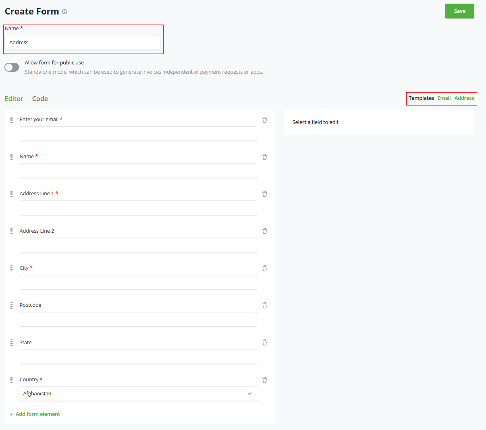

# Forms

BTCPay Server's Forms Builder enables you to request specific information from your customer. 

These forms are fully customizable to suit your requirements.
In this introduction, we will go through the visual form builder; if you'd like to do more advanced settings, please visit the [Advanced Forms](./AdvancedForms.md) section of our documentation. 

## Setting up your store's first Custom form. 

In this example, we will start with creating a standard form we've pre-made. 
Click on Store Settings and the last tab of your store settings is Forms. Click Forms to create your first Custom Form. 

On the custom forms page, click Create New Form. 
We've pre-made two examples, `Email` and `Address`. 
For this example, click the Address form. 

We can now drag around the fields pre-made by BTCPay Server.  
You can re-order them or create a new field by clicking on the `Add form element` at the bottom of the form. 

## Create a custom form.

You might have a different use case. For example if you own a restaurant you need to know the table number, how to call the customer when serving them, allergies, and special requests. 

Let's create a custom form in the following steps. 
We will start at the same settings tab from the previous example, Store settings -> Forms.

Click `create form` in the top right. 
We'll start by giving it a name; in the example, we will use `Restaurant.` 
Unlike before, we will start with the empty field that was generated. 

1. We will name the first field, `Table number` 
2. Define the `Type` of the field; we need it to be Text or Number, click on the drop-down and select `Number.`

3. The label we set for this field as it shows to the customer; in our example, we will name it `Table Number.`
4. Regarding The name of the field, we replicate the previous field's name, `Table Number,` for consistency. 
5. We could define a `Default value`; however, we'll keep it empty in the example.
6. `Helper Text` This is the text provided below the field we are creating to indicate what you request from the customer. 
7. Last, we can set two parameters; one is always to make it required to be filled out; in this example, we will set this to yes. And if it's a Constant, users can't change this so we won't use the setting for the example. 

After you've filled in the parameters for the field, it should show on the left of your editor how the field displays and functions when the customer interacts with it. 

Now that the first field is done, you can click on the `+ Add form element` below your first field and create the rest of the required form fields. Once you've made all the fields, click Save in the top right of your screen, and all should be set! 

The `Form Builder` makes creating custom forms flexible and easy to use. If you still require more personalization, as mentioned at the start of this guide, please read on [Advanced Forms](./AdvancedForms.md) to learn about the JSON created in the `Code` tab in the Form builder. 

## Support

If you have trouble using BTCPay Server, consider joining the [communities listed on the official website](https://btcpayserver.org/#communityCTA) to get help from BTCPay community members.

Only file a [Github issue](https://github.com/btcpayserver/btcpayserver/issues) for technical issues you can't resolve through other channels or feature requests you've validated with other community members.

Please check out our [official website](https://btcpayserver.org/),and [FAQ](./FAQ/README.md#btcpay-frequently-asked-questions-and-common-issues) for more details.

!!!include(supporters.html)!!!

