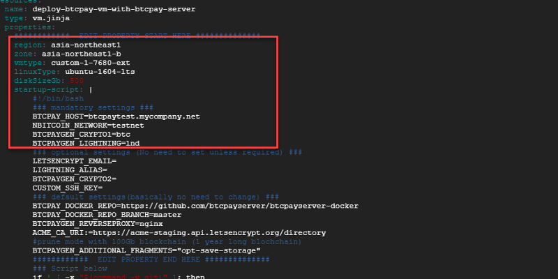

# Google Cloud Deployment

This setup is similar to the [Docker Deployment](DockerDeployment.md), except that the `docker-compose` is hosted by Google Cloud.

## Google Cloud shell setup

Google Cloud is alternative way to set up BTCPayServer.

Start by clicking the following button:

You can log into [Google Cloud Console](https://console.cloud.google.com) with your Google account.

Final installation steps:

* On Google cloud shell, Set the default project and zone where to deploy instance
* Change yaml file to configure VM instance and BTCPay server: 
* Change mode 755 for shell scripts  and run 'deploy.sh \<any deployname\>' to start depolyment
* (Wait for Google Cloud deployment for a minute)
* A static IP is shown on the Google cloud shell
* Go to your DNS service and map it with your domain name, say EXAMPLE.MYSITE.com
* ssh to the vm  from Google cloud console's VM instances list
* on ssh, Go to /btcpayserver-docker directry and run 'changedomain.sh EXAMPLE.MYSITE.com'
* Access to https://EXAMPLE.MYSITE.com by browser
* Click 'Register' and create an account - This will be your **admin** account!
* **Done!** Visit `https://EXAMPLE.MYSITE.com/stores` to create your store and begin invoicing.

For advanced users, you can connect via SSH with the information on `https://EXAMPLE.MYSITE.com/server/services/ssh`, and:

* Run `docker ps` and `docker logs xxx` to view running processes
* Run `btcpay-down.sh` and `btcpay-up.sh` to stop and start the BTCPayServer

Approximate Cost : **70 USD per month**

Learn more: [btcpayserver/btcpayserver-googlecloud](https://github.com/btcpayserver/btcpayserver-googlecloud)
