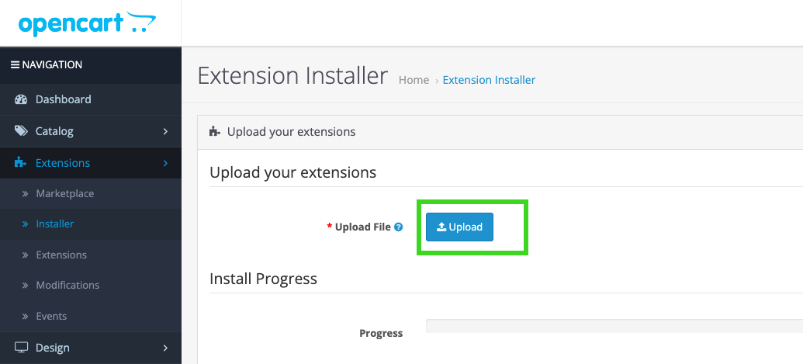
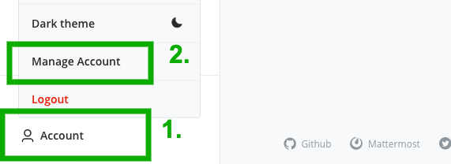
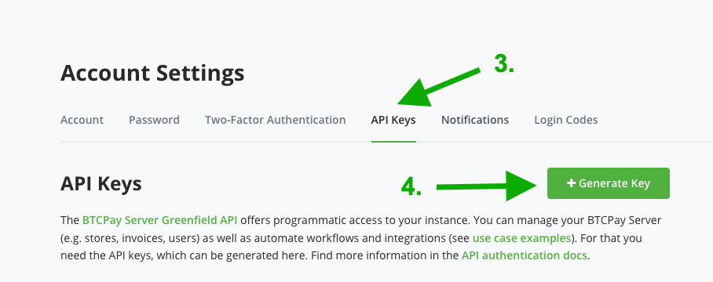
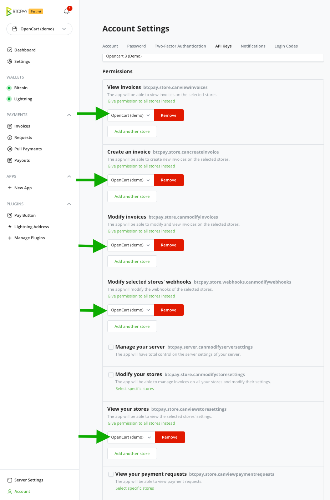
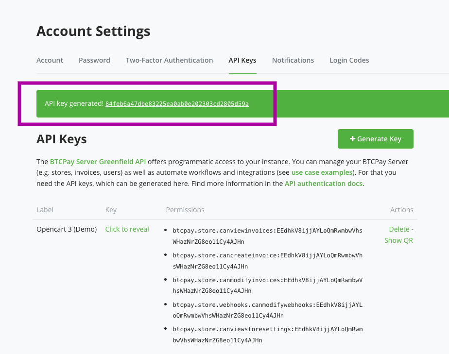
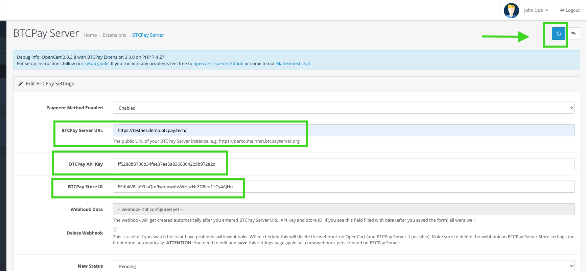
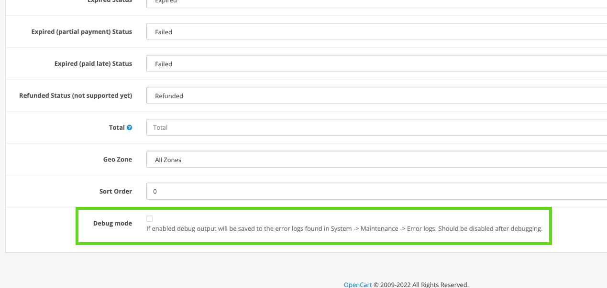

# OpenCart integration

This document explains how **to integrate BTCPay Server into your OpenCart store**.


## Requirements

Please ensure that you meet the following requirements before installing this extension.

- PHP version 7.4 or newer
- The curl, gd, intl, json, and mbstring PHP extensions are available
- A OpenCart 3 store ([Download and installation instructions](https://www.opencart.com/index.php?route=cms/download))
- **IMPORTANT:** You have a BTCPay Server version 1.3.0 or later, either [self-hosted](/Deployment/README.md) or [hosted by a third-party](/Deployment/ThirdPartyHosting.md)
- [You've a registered account on the instance](./RegisterAccount.md)
- [You've got a BTCPay store on the instance](./CreateStore.md)
- [You've got a wallet connected to your store](./WalletSetup.md)

## 1. Install BTCPay extension

There are three ways to **download the BTCPay for OpenCart extension**:

- Via the Admin Dashboard (recommended, see below)
- [OpenCart Marketplace](https://www.opencart.com/index.php?route=marketplace/extension/info&extension_id=44269)
- [GitHub Repository](https://github.com/btcpayserver/opencart)

### 1.1 Install the extension from OpenCart admin dashboard

Note: work in progress, extension undergoing review atm.


### 1.2 Download and install the extension from Marketplace or GitHub

1. Download the latest BTCPay extension from [Github](https://github.com/btcpayserver/opencart/releases) or [Marketplace](https://www.opencart.com/index.php?route=marketplace/extension/info&extension_id=44269)
2. Menu: Extensions -> Install 
3. Click the button [Upload] and upload the downloaded `btcpay.ocmod.zip`
After uploading, you should see a notice "Success: You have modified extensions!	"



### 1.3 Install the extension 
1. Menu: Extensions -> Extensions
2. On the "Choose extension type" dropdown, select "Payment".
3. On the "Action" column, click the green install button.
4. You will see a notification " Success: You have modified payments!"


## 2. Connecting OpenCart and BTCPay Server

Please make sure to have a BTCPay Server instance setup as described in the [requirements](#requirements) above.

BTCPay for OpenCart extension is a **bridge between your BTCPay Server (payment processor) and your e-commerce store**.
No matter if you're using a self-hosted or third-party solution, the connection process is identical. 

### 2.1 Configure BTCPay Server extension in OpenCart

1. Menu: Extensions -> Extensions
2. Click the blue edit button

3. Configure BTCPay extension. 
4. On the field "Payment Method Enabled" set it to `Enabled`
5. On field "BTCPay Server URL" set it to the URL where your BTCPay Server instance is reachable on the internet e.g. `https://mainnet.demo.btcpayserver.org/`. You can find information on how to deploy your BTCPay Server instance in the [requirements section above](#requirements)

Before you can continue, you need to create the API key for your user and store, as described in the next section. Keep this browser tab open, as we will come back shortly.

### 2.2 Create an API key and configure permissions

On your BTCPay Server instance:

1. Click on *[Account]*
2. Click on *[Manage Account]*

3. Go to the tab *"API Keys"*    
4. Click *[Generate Key]* to select permissions.   

5. "Label": Add a label.    
6. "Permissions": **Important:** click on the *"Select specific stores"* link for the following permissions: `View invoices`, `Create invoice`, `Modify invoices`, `Modify stores webhooks`, `View your stores` and select the store you created for your OpenCart site. This makes sure that the API key only has access to that specific store and can't drain any funds even if the key is lost.
    
It should look like this:
 
7. Click on *[Generate API Key]* at the bottom
8. Copy the generated API Key to your *OpenCart BTCPay settings* form field "BTCPay API Key"
 
8. Back on BTCPay Server instance, go to your store settings and copy the store ID to your *OpenCart BTCPay Settings* form   
 
9. Back on *OpenCart BTCPay settings* form make sure **BTPCay Server URL**, **API Key** and **Store ID** are set and click **[Save]** button (on the top right)    
 

You should get back to the Extensions overview page and see the notification "BTCPay Server Payment details have been successfully updated.". If not, ensure your URL, API Key and Store ID are correct.
 

On successfully saving, the BTCPay extension automatically creates a webhook so OpenCart can get notified when payments settle or fail. To double check it was successful. You can do that by editing the BTCPay extension settings again if you see the "Webhook Data" field filled out like this:
 

As you can see on the BTCPay extension settings, you can customize the order statuses depending on the [invoice statuses](https://docs.btcpayserver.org/Invoices/#invoice-statuses) and other common settings. The defaults should be a good starting point but feel free to adjust them to your use case. 

## 3. Test the checkout

Everything is ready to go now. Make a small test purchase and make sure the order status gets updated according to the BTCPay invoice status. On the BTCPay Server invoice details, you can see if the webhook events were successful.

## Troubleshooting

### Enable debug mode

If you have an error during checkout, you can enable the debugging mode on the BTCPay extension settings. Menu: Go to "Extensions -> extensions" select "Payments" on the "Choose Extension Type" dropdown and edit BTCPay Server extension.

 

You can now find the debug output in the `error log` in the menu "System -> Maintenence -> Error Logs".

 

*Please make sure to disable it after debugging is finished; otherwise, it will fill up your error logs.**


**Example Error**:   
> 2022-05-24 21:10:50 ERROR Error during POST to https://btcpay.example.com/api/v1/stores/4kD5bvAF5j8DokHqAzxb6MFDV4ikabcdefghijklm/invoices. Got response (401): {&quot;code&quot;:&quot;unauthenticated&quot;,&quot;message&quot;:&quot;Authentication is required for accessing this endpoint&quot;}

- This means there is some authentication error. Likely your API key does not have permission to create invoices for that store. Make sure you give the API key the correct permissions, give it to the right store, and enter that in the OpenCart payment configuration form.

- Another reason could be that you use a legacy API key. The legacy API keys are located in store settings -> Access Tokens. But you need to create an account API key located in Account -> Manage Account -> tab "API Keys". See section [2.2 Create an API key and configure permissions](#22-create-an-api-key-and-configure-permissions).


## The order states do not update, although the invoice has been paid.
Please check your invoice details to see if there were any errors on sending the webhook request. Some hosting providers, firewall setups, or security extensions may block POST requests to your site, which leads to an HTTP status of "403 forbidden". 

You can check and verify yourself if there is something blocking requests to your site in one of these two ways:

**1. Copy webhook callback URL**   
Go to your *OpenCart BTCPay extension settings* and copy the "URL" of the "Webhook Data" field. e.g., `https://YOURSTOREDOMAIN.TLD/index.php?route=extension/payment/btcpay/callback`

 

**2.1 Check using a command line (Linux or MacOS):**   

```
curl -vX POST -H "Content-Type: application/json" \
    -d '{"data": "test"}' WEBHOOK_CALLBACK_URL
```
(replace `WEBHOOK_CALLBACK_URL` with the one copied above)

Result:

```
.... snip ....
* upload completely sent off: 16 out of 16 bytes
< HTTP/1.1 403 Forbidden
< access-control-allow-origin: *
< Content-Type: application/json; charset=UTF-8
< X-Cloud-Trace-Context: 4f07d5b2e5c2f05949d04421a8e2dd6a
< Date: Thu, 17 Feb 2022 10:06:50 GMT
< Server: Google Frontend
< Content-Length: 26
```

If you see that line "HTTP/1.1 403 Forbidden" or "HTTP/2 403" something is blocking data sent to your OpenCart site. It would be best to ask your hosting provider or make sure no firewall or security extension is blocking the requests.

**2.2 Check using an online service (if you do not have a command line available:**   

- Go to [https://reqbin.com/post-online](https://reqbin.com/post-online) 
- 1. Enter your callback url (copied from step 1 above): `https://YOURSTOREDOMAIN.TLD/index.php?route=extension/payment/btcpay/callback`
  (replace this URL with the webhook callback url from step 1)
- Make sure "POST" is selected
- 2. Click [Send]


If you see "**Status 403 (Forbidden)**" then POST requests to your site are blocked for some reason. You should ask your hosting provider or ensure no firewall or security extension is blocking the requests. If you see any other status code (200, 500, ...) a firewall problem seems not to apply. You probably need to investigate further.


## I have trouble with using the extension or some other related questions.

Feel free to join our support channel over at [https://chat.btcpayserver.org/](https://chat.btcpayserver.org/) or [https://t.me/btcpayserver](https://t.me/btcpayserver) if you need help or have any further questions. 

