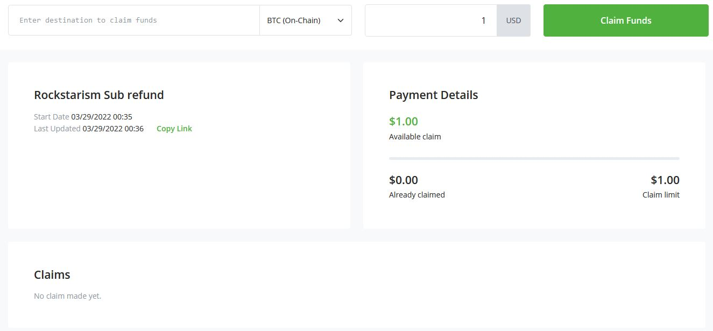
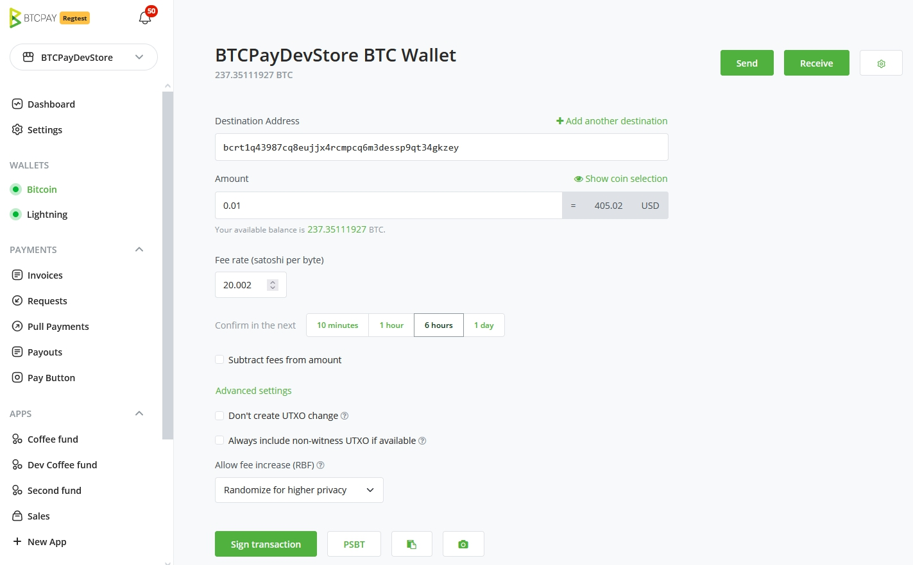
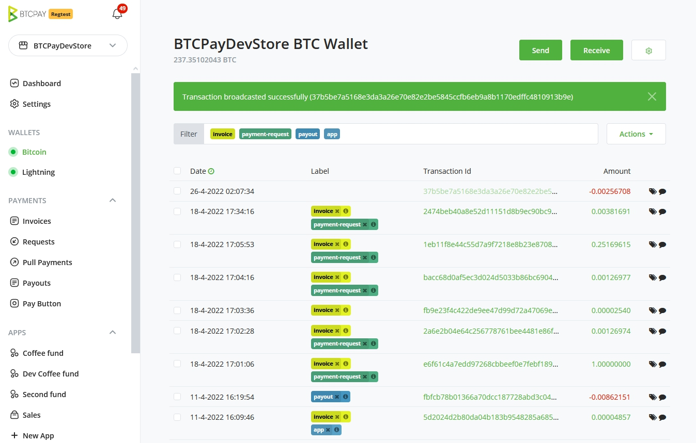

# Refunds

:::tip
If you are looking for information about requesting a refund from a merchant, please refer to this [FAQ](./FAQ/General.md#what-if-i-have-a-problem-with-a-paid-invoice)
:::

**Refunds** are one of the applications built on top of the [Pull Payments](./PullPayments.md) feature.

Up until now, merchants had to manually issue refunds.
The process required a lot of back and forth between a sender and a receiver. The merchant had to ask for a refund address, calculate the preferred rate, manually add that to the wallet and broadcast the transaction.

A merchant just need to go to the invoice, click **Issue refund** , select the appropriate rate and share a link with a customer.

The customer will then input their address and claim a refund. Once a customer claims a refund, the merchant will get a notification and can authorize it in a click.
Future versions of BTCPay Server will enable instant payouts as an option, without the need for merchant approval.

## Create a refund

1. After an invoice has been confirmed, go in the Invoices page and click 'Details' on the invoice.

2. Click 'Issue a refund'

3. Select the way how you want to issue the refund

4. Select the amount you want to refund

5. Share the Link of this page to your costumer

## How to process the refund

After you delivered the refund link to costumer, there is a little more to this flow.
The costumer might decide to not claim all at once, and you as a merchant might have many refunds open.
After the customer has done their part, you go to the Payouts tab in your BTCPay server or check the notifications top left.
Notice from here we will call it a payout instead of a refund as we turn to you the merchant.

Both tabs BTC (On-Chain) and BTC (Off-Chain) work in the similar ways.
First off its Awaiting Approval, this tab makes most sense for store clerks to just Approve refunds throughout the day.
The actions tab varies with the permissions the user has, you can Approve, Approve and Send or Cancel a payout.
* Approve will simply change the state of the payment to awaiting payment and shows the claimant that his claim is now in progress.
This does not directly do the actual Payout but rather sets it up for one with permissions to do so or cancel if its not valid.
The Payout will now be found in Awaiting Payment, here it would be possible to Batch multiple Payouts.
* Approve and Send is only available for those with permissions to.
This will directly prompt you for signing the payouts that you selected. It also will show to claimant that claim is in Progress.
After the transaction has been signed, claimant now may also see the transaction tied to his claim by clicking the Progress button in his claim view.
* Cancel payout.
This will cancel the Payout directly.
However, the refund is still active and Claimant may request another refund. He will see a Cancel claim status in his view.

After the Payout has been approved and is ready to be signed (This again might be done trough batching by the appropriate permissions).
Be sure to check the address if it is indeed a valid bitcoin address (For the security of the costumer and his funds).
Check the amount requested by the costumer, set a fee rate and if those fees are deducted from the amount.
Check the Advanced settings for * No [UTXO Change](./Wallet.md)
* Always include non-witness UTXO if [available](https://medium.com/@jmacato/wasabi-wallets-advisory-for-trezor-users-7d942c727f92)
* Allow Fee increase [RBF](./Wallet.md)
And after that its time to sign the transaction(Or multiple transactions if you decided to batch)

After the signing comes broadcasting.

When the broadcast happened, the payout moved from the Awaiting Approval/Payment status to In Progress.
In this tab you will find all the Payouts separately along with their links to the transaction.
Claimant now is also able to see the Actual Transaction tied to his claim.

Whenever the transaction gets accepted and is no longer in progress it moves to the Completed tab.
Here again you will find the link to the transaction for historical purposes.
For the Claimant his status now has gone to complete as well.
If claimant now still has funds left to claim, he can re do the process and you as merchant again will follow the above steps too.
His future status will show on top of the former claims on the same page.

Costumer's view

## Questions

If you have questions about the BTCPay Server refunds function, you can join the [community chat](https://chat.btcpayserver.org/).
If you have questions about any of the other tools or commands, etc. it's likely you can find answers to your questions by doing a search on the internet or on [StackOverflow](https://stackoverflow.com/).