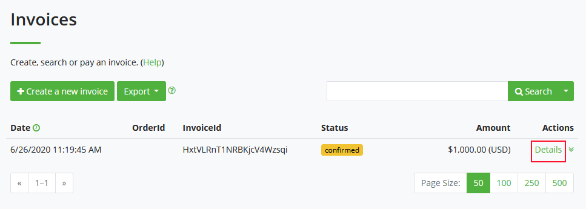
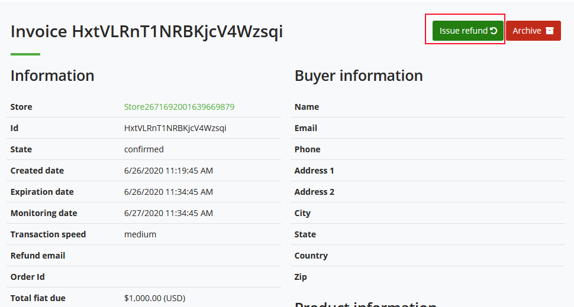
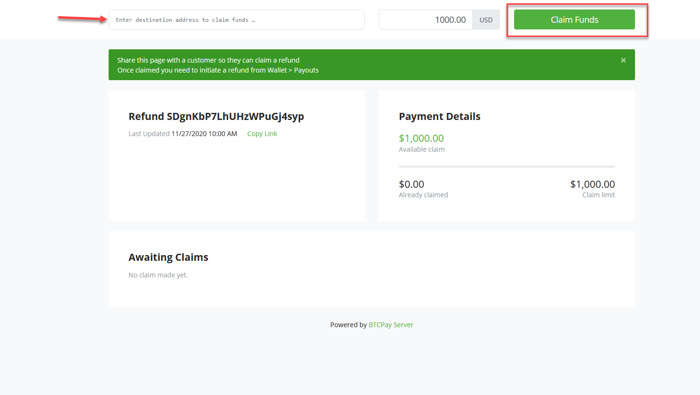

# Refunds

Refunds are one of the use cases that use the `Pull Payments` feature.

Up until now, merchants had to manually issue refunds.
The process required a lot of back and forth between a sender and a receiver. The merchant had to ask for a refund address, calculate the preferred rate, manually add that to the wallet and broadcast the transaction.

, a merchant just needs to go to the invoice, click Issue refund , select the appropriate rate and share a link with a customer.

The customer will then input their address and claim a refund. Once a customer claims a refund, the merchant will get a notification and can authorize it in a click.
In future releases, we will look into payouts which are approved to be paid out instantly, without the authorization, in case a merchant prefers that.

## Create a refund

* After an invoice has been confirmed, go in the Invoices page and click `Details` on the invoice.

* Click `Issue a refund`

* Select the way you want to issue the refund

* You can now share the pull payment link with the customer

