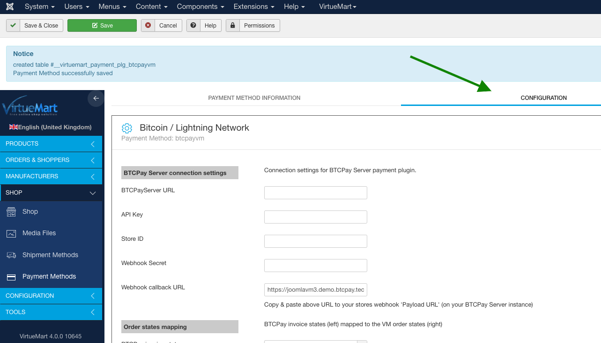
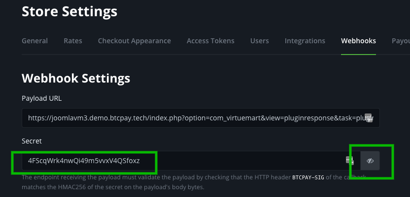
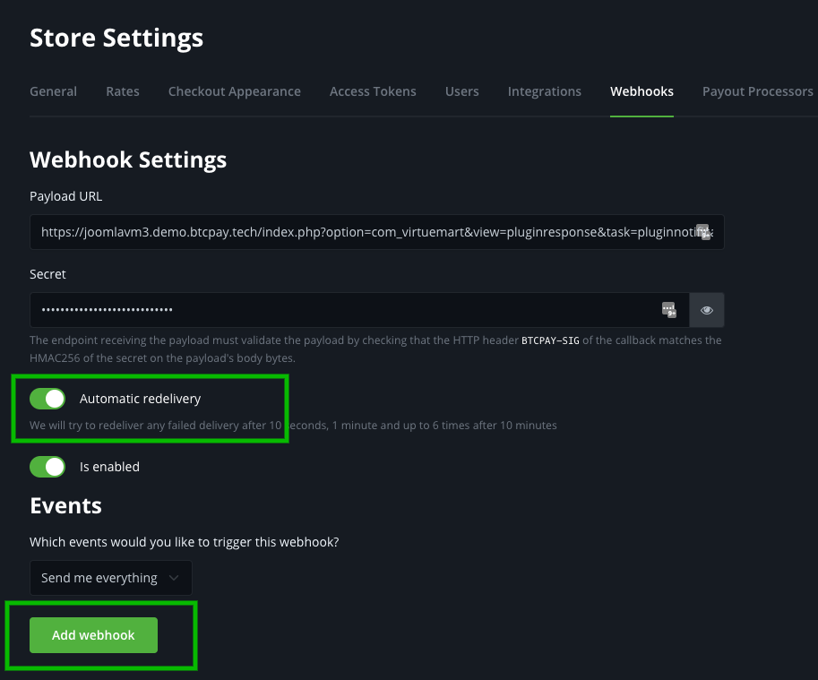

# Joomla VirtueMart integration

This document explains how to **integrate BTCPay Server into your Joomla VirtueMart store**.

## Requirements

Please ensure that you meet the following requirements before installing this plugin.

- PHP version 7.4 or newer
- The curl, gd, intl, json, and mbstring PHP extensions are available
- A VirtueMart 3 / 4 store ([Download and installation instructions](https://www.virtuemart.net/downloads))
- You have a BTCPay Server version 1.3.0 or later, either [self-hosted](/Deployment/README.md) or [hosted by a third-party](/Deployment/ThirdPartyHosting.md)
- [You've a registered account on the instance](./RegisterAccount.md)
- [You've a BTCPay store on the instance](./CreateStore.md)
- [You've a wallet connected to your store](./WalletSetup.md)

## 1. Install BTCPay Plugin

There are three ways to **download BTCPay for VirtueMart plugin**:

- Via the Admin Dashboard (recommended, see below)
- [Joomla Extension Directory (JED)](https://extensions.joomla.org/extension/btcpay-virtuemart/)
- [GitHub Repository](https://github.com/btcpayserver/joomla-virtuemart/releases)

### 1.1 Install plugin from Joomla Admin Dashboard (recommended)

1. Menu: Extensions > Manage > Install
2. In Search, type "BTCPay"
3. Click on BTCPay for VirtueMart and [Install] button
4. Continue with step 1.3 

### 1.2 Download and install plugin from JED or GitHub

1. Download the latest BTCPay plugin from [Github](https://github.com/btcpayserver/joomla-virtuemart/releases) or [JED](https://extensions.joomla.org/extension/btcpay-virtuemart/)
2. Menu: Extensions -> Manage -> Install 
3. On tab "Upload Package File" upload the btcpayvm.zip 

### 1.3 Enable the plugin
1. Menu: Extensions -> Plugins
2. Search for "btcpay"
3. On "Status" column click the red circle to enable the plugin

## 2. Connecting VirtueMart and BTCPay Server

BTCPay for Virtuemart plugin is a **bridge between your BTCPay Server (payment processor) and your e-commerce store**.
No matter if you're using a self-hosted or third-party solution, the connection process is identical. 

### 2.1 Add BTCPay payment gateway in VirtueMart

1. Menu: VirtueMart -> Payment Methods
2. Click button **[New]**

3. Configure the payment method according to your needs. Make sure on "Payment Method" dropdown you have "BTCPay for VirtueMart" selected and the payment method is published 
4. Hit the **[Save]** button (the plugin table will get created)

Now you can switch to the "Configuration" tab where we can connect to our BTCPay Server instance. First we need to create an API key. 

### 2.2 Create an API key and configure permissions

On BTCPay Server instance:

1. Click on *[Account]*
2. Click on *[Manage Account]*

3. Go to the tab *"API Keys"*    
4. Click *[Generate Key]* to select permissions.   

5. Add a label. **Important:** click on the *"Select specific stores"* link for the following permissions: `View invoices`, `Create invoice`, `Modify invoices`, `Modify stores webhooks`, `View your stores` and select the specific store you created for your VirtueMart site. It should look like when everything is set:
 
6. Click on *[Generate API Key]*   
 
7. Copy the generated API Key to your *VirtueMart BTCPay Payment Method Settings* form   
 
8. Go to Settings and copy the store ID to your *VirtueMart BTCPay Payment Method Settings* form   
 
9. On the *VirtueMart BTCPay Payment Method Settings* form make sure **BTPCay Server URL**, **API Key** and **Store ID** are set and click **[Save]**     
 

### 2.3 Create a webhook on BTCPay Server

Setting up a webhook is important that your gets updates on invoice status changes from BTCPay Server. 

1. On BTCPay Server instance go to your store settings, tab **[Webhooks]**, click **[Create Webhook]**
 
2. From *VirtueMart BTCPay Payment Method Settings* copy the **Webhook callback URL** to webhook settings **Payload URL**.
 
3. On webhook settings click on the eye to reveal webhook secret. Copy that secret to your *VirtueMart BTCPay Payment Method Settings* form **Webhook Secret** input and **[Save]** the VirtueMart configuration again.

4. Back on webhook settings, enable **Automatic redelivery** and click **[Add webhook]** to save the webhook.

## 3. Test the checkout

Everything is ready to go now. Do a small test purchase and make sure the order status gets updated according to the BTCPay invoice status. On BTCPay Server invoice details you can see if the webhook events were fired successfully.

## Customizing VirtueMart BTCPay payment method settings

todo 

## Troubleshooting

todo

